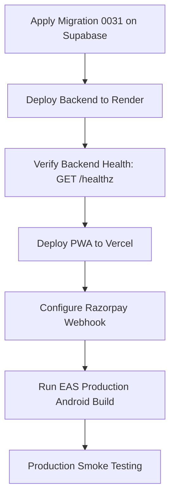

# Jainune v2 — Post-Fix & Production Launch Runbook

Comprehensive operational guide detailing the sequence of actions required after completing code-level fixes to transition into staging and production release.

---

## Phase 1: Repository & Codebase Finalization

### 1.1 Stage & Commit PWA & Platform Fixes
All PWA runtime assets, platform shims, and migrations must be staged and committed to git:
```bash
git add backend/migrations/0031_web_push_subscriptions.sql \
        backend/migrations/down/0031_web_push_subscriptions.down.sql \
        backend/scripts/generate_web_push_keys.py \
        backend/tests/unit/test_web_push_delivery.py \
        mobile/public/ \
        mobile/src/components/auth/ \
        mobile/src/services/notifications.web.ts \
        mobile/src/services/turnstile.ts \
        mobile/src/services/turnstile.web.ts \
        mobile/src/utils/platformAlert.ts \
        mobile/src/utils/platformAlert.web.ts \
        mobile/src/utils/secureStorage.ts \
        mobile/src/utils/secureStorage.web.ts

git commit -m "feat(pwa): add PWA public assets, W3C Web Push, decoupled checkout, and web platform shims"
git push origin v2-optimize
```

### 1.2 Generate VAPID Push Keys
Run the generator script locally once to produce a cryptographically valid P-256 VAPID key pair:
```bash
python backend/scripts/generate_web_push_keys.py
```
> [!IMPORTANT]
> Save the output `WEB_PUSH_VAPID_PUBLIC_KEY` and `WEB_PUSH_VAPID_PRIVATE_KEY`. The private key must **never** be shared, committed to git, or placed in client builds.

### 1.3 Apply Supabase Database Migration
Execute migration `0031` inside the Supabase SQL Editor:
* File: `backend/migrations/0031_web_push_subscriptions.sql`
* Creates the `web_push_subscriptions` table (`user_id`, `device_id`, `endpoint`, `p256dh`, `auth`) with unique index on `endpoint`.

---

## Phase 2: Environment & Secret Provisioning Matrix

Do not upload local `.env` files to cloud platforms. Inject variables directly into their respective dashboards:

### 2.1 Backend Services on Render (`jainune-backend-api`)

Navigate to **Render Dashboard → jainune-backend-api → Environment**:

| Variable Category | Keys to Configure | Crucial Operational Details |
|---|---|---|
| **Database & Cache** | `DATABASE_URL`<br>`SUPABASE_URL`<br>`SUPABASE_SERVICE_ROLE_KEY`<br>`REDIS_URL` | **Mandatory:** `DATABASE_URL` must use Supabase Transaction Pooler (`aws-0-*.pooler.supabase.com:6543`). Render has IPv4-only egress; direct Supabase port 5432 resolves to IPv6 and will fail. |
| **Auth & Security** | `GOOGLE_CLIENT_ID`<br>`TURNSTILE_SECRET_KEY`<br>`MSG91_AUTH_KEY`<br>`MSG91_OTP_TEMPLATE_ID`<br>`SMTP_HOST`<br>`SMTP_USER`<br>`SMTP_PASSWORD` | `TURNSTILE_SECRET_KEY` must match Cloudflare site key used by frontend. |
| **Billing (Razorpay)** | `RAZORPAY_KEY_ID`<br>`RAZORPAY_KEY_SECRET`<br>`RAZORPAY_WEBHOOK_SECRET` | If `ENVIRONMENT=production`, backend rejects `rzp_test_*` keys. For staging tests, set `ENVIRONMENT=staging`. |
| **Web Push & Mobile** | `WEB_PUSH_VAPID_PUBLIC_KEY`<br>`WEB_PUSH_VAPID_PRIVATE_KEY`<br>`WEB_PUSH_VAPID_SUBJECT`<br>`GOOGLE_PLAY_SERVICE_ACCOUNT_JSON`<br>`FCM_SERVICE_ACCOUNT_JSON` | Store JSON credentials as raw single-line strings. Subject must be `mailto:noreply@jainune.com`. |
| **Moderation** | `CLOUDFLARE_ACCOUNT_ID`<br>`CLOUDFLARE_API_TOKEN` | Enables Cloudflare AI Vision image checks (governed by 15 RPM pacing and daily neuron limits). |

#### Render Secret Files Panel
Under **Environment → Secret Files**, add:
* `/etc/secrets/jwt_rsa.key` (Private RSA PEM)
* `/etc/secrets/jwt_rsa.pub` (Public RSA PEM)
*(Preserving persistent keys prevents user session invalidation across container redeploys).*

---

### 2.2 PWA Frontend on Vercel

In **Vercel Dashboard → Project Settings → Environment Variables**, configure client-only public keys:

```ini
EXPO_PUBLIC_API_URL=https://jainune-backend-api.onrender.com/v1
EXPO_PUBLIC_WS_URL=wss://jainune-backend-api.onrender.com/v1/ws/chat
EXPO_PUBLIC_GOOGLE_WEB_CLIENT_ID=YOUR_GOOGLE_OAUTH_WEB_CLIENT_ID.apps.googleusercontent.com
EXPO_PUBLIC_TURNSTILE_SITE_KEY=YOUR_CLOUDFLARE_TURNSTILE_SITE_KEY
```

#### Custom Domain Setup:
1. In Vercel Project Settings → Domains, enter `app.jainune.com`.
2. In your DNS provider (Cloudflare / Namecheap / GoDaddy), add:
   * **Type:** `CNAME`
   * **Name:** `app`
   * **Target:** `cname.vercel-dns.com`
3. Vercel automatically provisions SSL certificates.

---

### 2.3 Android Production Builds on EAS (Expo Application Services)

1. **EAS Dashboard → Project Settings → Environment Variables**:
   * Set `EXPO_PUBLIC_GOOGLE_WEB_CLIENT_ID`
   * Set `EXPO_PUBLIC_WS_URL`
   * Set `EXPO_PUBLIC_SENTRY_DSN`
2. **EAS Credentials**:
   * Configure Android Upload Keystore (generate via EAS or upload existing `.jks`).
   * Upload Google Play Service Account Key for auto-submitting builds to closed/internal testing tracks.
3. **Build Execution**:
   ```bash
   cd mobile
   eas build --platform android --profile production
   ```
   *Note: APP-07 release signing is handled inside EAS; APP-09 auto-increments version codes remotely.*

---

## Phase 3: Launch Execution & Verification Flow



### 3.1 Verification & Smoke Tests

#### A. iOS Safari & PWA Verification
1. Open `https://app.jainune.com` in mobile Safari.
2. Tap **Share → Add to Home Screen**.
3. Launch from Home Screen:
   * Confirm address bar and browser chrome are hidden (standalone mode).
   * Navigate to **Settings → Notifications**: tap "Enable Notifications" and grant permission.
   * Verify push token registers in backend table `web_push_subscriptions`.
4. Test Decoupled Billing:
   * Select a subscription tier.
   * Verify standalone Razorpay checkout opens with CSP nonce.
   * Complete test payment and verify redirection back to `/subscriptions?payment=success`.

#### B. Android Release Verification
1. Download production `.aab` from EAS.
2. Distribute via Google Play Internal Testing Track.
3. Test Google Play Billing subscription purchase.
4. Verify server acknowledgement via `/v1/subscriptions/verify-google-play`.

#### C. Operational Monitoring
* **Web Push Delivery:** Check Render logs for `pywebpush` HTTP 201 responses.
* **Database Pool:** Confirm Supabase connection pool usage stays under limits with Render transaction pooling.
* **Photo Moderation:** Monitor Cloudflare AI Vision RPM pacing lock (max 15 RPM).
